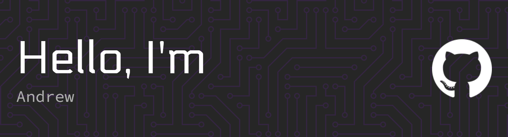

</img>

# 👋Quick about me

I am interested in electronics and i am able to do 3d-modeling, video editting, programming, and electronics. I also like making websites and really like homelabbing and networking and getting to self host apps aswell as develop a smart home.

Status: Student
web dev portfolio: web.andrewwang.studio
engineering portfolio: eng.andrewwang.studio

# ✍️Projects

- 1 website (private)
- 2 projects (private)
- 2 robotics repos (private)
- 1 public completed project

  
<b>:computer: &nbsp;"Languages" I know</b>

   

&nbsp;\
&nbsp;\
&nbsp;\
&nbsp;\
&nbsp;

  
<b>🛠️ &nbsp;Tools i know</b>

   

&nbsp;\
&nbsp;\
&nbsp;\
\
&nbsp;\
&nbsp;\
&nbsp;\
&nbsp;\
&nbsp;\
&nbsp;

